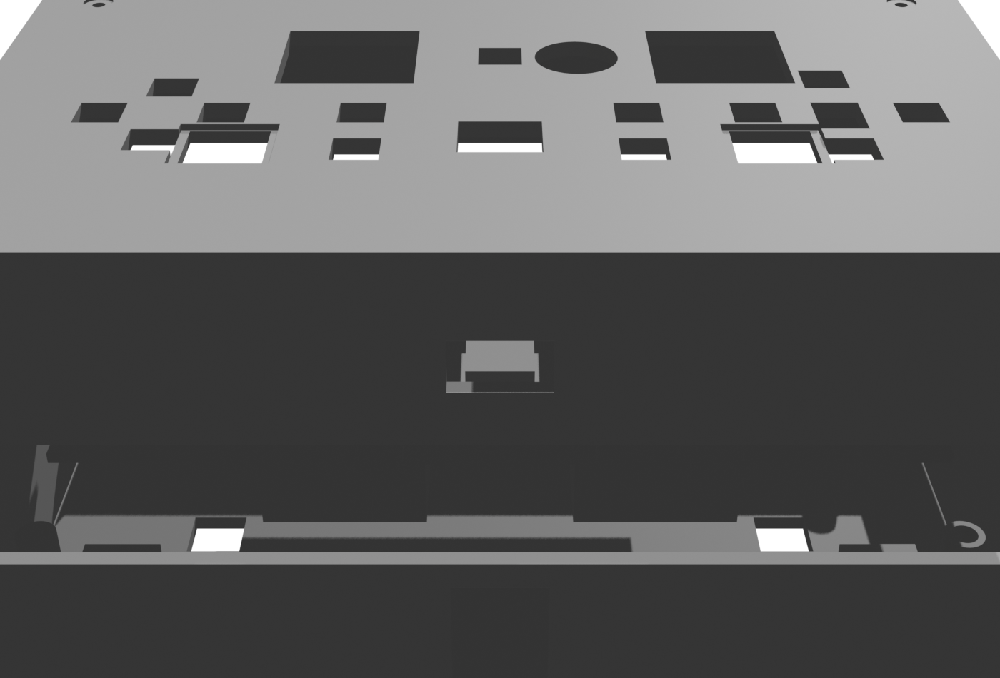
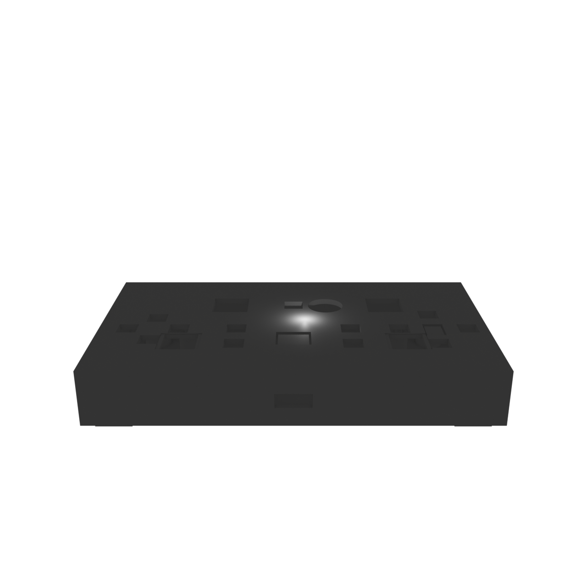

# SuperPad-V1 (Alpakka) 外壳

> **交付版本 v1.0**（几何冻结，交付日期 2026-09-08 持续维护——最新 commit 日期为准）：bottom = back_v12（3044 三角 / 87.5 cm³）、top = front_v8（2148 三角 / 61.6 cm³）、rods = v6e（804 三角 / 9.2 cm³，20 件；v6e = v6d + 延长套杆盲孔——延长底部 Ø6.0×3 mm 盲孔套编码器杆（原实心无孔、旋转传动薄弱暗病已修）；v6d = v6 斜楔修订版——滑块帽 13.6×11.6/沉槽 14.2×12.0 收窄帽晃）。验证套件 `verify/enclosure_verify.py` v12 一键回归（水密/拓扑/装配/运动学/法线字段）。
> **维护规则**：任何 STL 几何修改后必须重跑验证套件并更新本 README 的三角数/体积/版本映射；PCB 修改后按文末"维护"指引重核。

3D 打印外壳，覆盖 `superpad_v1_main` PCB（130 × 71.0 mm，主板，KiCad 工程 `alpakka.kicad_pcb`）+ Marmota 核心模块叠层（70 × 70 mm，B.Cu 侧板对板叠装）。




> 来源：KiCad 工程 `hardware/alpakka_kicad/projects/alpakka/alpakka.kicad_pcb` + `hardware/alpakka_kicad/projects/marmota/marmota.kicad_pcb` 实测板框与元件位置（主板 X 35–165 / Y 25–96，叠放偏移 主板 = Marmota + (40, −5)）。
> 风格：**按原版 Alpakka 曲面手柄造型重新设计**（161 × 100 mm 圆角矩形，角 R20、壁 2.5 mm），USB-C 从 -Y 短边出线，摇杆/编码器/按键从面板开孔穿出，**4 根独立按压杆（L2/R2/L4/R4）+ 2 根肩键楔形滑块 + 4 根 M3 螺丝柱（配螺纹孔）**。
> 主要特点：**容纳主板背面 Marmota 模块叠层（11 mm）的深底壳（总深 34 mm）+ 曲面圆角面板顶盖（开孔让控件穿出）+ 一体式支撑/定位结构（挖腔留柱，与薄壳同源材料，无漂浮件）**。
> 位置修正记录：摇杆 U2（rot 90°）、扳机 S19/S20（rot ±90°）的孔位方向已按 KiCad 元件旋转角修正；**S15/S16 为 SKHHL 侧按开关，改用楔形滑块传动按钮 + 11.6×14.8 孔 + 沉槽 14.2×12.0；扳机 S17–S20 按 SKQG（6 × 6 mm）开 9.0 × 9.0 方形孔**（帽 8.5×8.5 藏孔内导向）。

## 环境要求（复现/修改本交付）

> - **验证套件**：Python 3.8+（纯 stdlib，无第三方依赖）`python verify/enclosure_verify.py` 直接运行（输出三 STL 健康 + 装配/运动学 + FINAL）。
> - **几何源文件**：`blender/enclosure.blend` 需 **Blender 4.x/5.x** 打开（5.2 验证 OK；导出 STL 用 File→Export→STL，保持 50 字节头二进制格式）。
> - **打印切片**：任一切片器（Cura/PrusaSlicer/Orca）按"打印参数建议"设置；床 ≥ 180×180。
> - **PCB 同步**：KiCad（板框来源）+ 嘉立创 EDA（坐标换算见协作章节）。

## 目录结构

```

**章节导航**
- [环境要求（复现/修改本交付）](#环境要求复现修改本交付)
- [目录结构](#目录结构)
- [几何参数](#几何参数)
- [元件位置（Blender 单位 mm，外壳坐标系：底壳底 z=0，PCB 顶面 z=17）](#元件位置blender-单位-mm外壳坐标系底壳底-z0pcb-顶面-z17)
- [打印参数建议](#打印参数建议)
- [关键设计验证](#关键设计验证)
- [打印件清单 vs 占位件（防混淆）](#打印件清单-vs-占位件防混淆)
- [关键配合间隙表（打印前参考，单位 mm）](#关键配合间隙表打印前参考单位-mm)
- [占位件尺寸假设清单（可靠性分级）](#占位件尺寸假设清单可靠性分级)
- [BOM 采购清单（装填件，对照元件表）](#bom-采购清单装填件对照元件表)
- [外购件尺寸约束（防碰撞）](#外购件尺寸约束防碰撞)
- [装配说明书（8 步）](#装配说明书8-步)
- [rods.stl 件数体积分布（打印排布参考）](#rodsstl-件数体积分布打印排布参考)
- [交付文件校验和（SHA-256，下载后验证完整性）](#交付文件校验和sha-256下载后验证完整性)
- [嘉立创 EDA 协作工作流](#嘉立创-eda-协作工作流)
- [验证套件判据说明（enclosure_verify.py v12 如何判定 OK）](#验证套件判据说明enclosure_verifypy-v12-如何判定-ok)
- [打印首版实测 QA 清单（装机后逐项验收）](#打印首版实测-qa-清单装机后逐项验收)
- [待实测/风险集中清单（全部风险项一览）](#待实测风险集中清单全部风险项一览)
- [打印启动前检查单（照单逐项确认）](#打印启动前检查单照单逐项确认)
- [装配失败诊断表（症状 → 原因 → 处置）](#装配失败诊断表症状-原因-处置)
- [打印失败诊断表（症状 → 原因 → 处置）](#打印失败诊断表症状-原因-处置)
- [后续可优化项（按优先级）](#后续可优化项按优先级)
- [维护与同步（PCB 修改后必读）](#维护与同步pcb-修改后必读)
enclosure/
├── blender/                  # Blender 源文件
│   └── enclosure.blend       # 主文件, PCB + 元件占位 + 底壳/顶盖 + 4 按压杆 + 2 肩键滑块
├── stl/
│   ├── bottom.stl            # 底壳 STL (3044 三角面, 单连通水密开口壳, 87.5 cm³)
│   ├── top.stl               # 顶盖 STL (2148 三角面, 单连通水密, 61.6 cm³, 含坐腔筒 z2.5-30, 滑块孔 11.6×14.8（沉槽 14.2×12.0 收窄帽晃 1.0→0.2）)
│   └── rods.stl              # 按压杆×4 + 肩键滑块×2(v6d斜楔) + 键帽×13 + 编码器延长×1 (804 三角面, 9.2 cm³, 延长含套杆盲孔) - 独立小件(打印方向:滑块帽朝下)
├── verify/
│   ├── enclosure_verify.py   # 验证套件 v12（12 项一键回归：水密/拓扑/装配/运动学/法线字段）
│   └── export_stl.py          # 维护工具：blend 几何修改后一键重导出 3 STL（Blender 5.x）
├── QA_first_build.md         # 首版实测 QA 记录模板（装机后逐项填写：✓/✗+实测值，见 QA 章节使用说明）
├── _shot_full.png            # Blender 渲染图（装配视图：底壳+Marmota+主板+顶盖）
├── _shot_exploded.png        # 爆炸视图渲染图
├── _shot_shell.png           # 外壳单体视图渲染图
└── README.md
```

## 几何参数



### 整体

| 维度 | 数值 |
|---|---|
| 外尺寸（X×Y×Z） | 161.0 × 100.0 × 34.0 mm（底壳体高 34，含支脚底 −1.0 总高 35）；**含凸出件包络**：旋钮顶 36 为最高点（凸 2）、帽盘/滑块帽/键帽 30.5–34 齐口环内——整机包络 161 × 100 × 36（携行/收纳参考；含支脚总包络高 37：z −1..36） |
| 外形 | 圆角矩形（角 R20，抄原版 Alpakka 造型比例），**外圆内直**（内腔直角） |
| 壁厚 | 2.5 mm（原版 2.0 加厚，打印强度） |
| 主板尺寸 | 130.0 × 71.0 mm（1.6 mm 厚） |
| 内腔尺寸 | 156.0 × 95.0 × 31.5 mm（底 2.5 厚，挖穿至顶 z34 开口壳） |
| 装配关系 | 底壳 z 0–34，主板顶面 z = 17（PCB loc 17），顶盖坐腔筒 z 2.5–30 嵌入底壳腔 0.25/边 + 面板盘 27.5–30 凹嵌口环 4 mm |
| 固定方式 | **M3 螺丝柱 ×4**（r3 柱 + 法兰 嵌入壁内，柱实心自攻直拧）+ 顶盖 M3 沉孔 ×4 |
| PCB 支撑 | 支撑块 ×4（12×12×12.8 @±60,±30）+ 定位小台 ×4（10×10×1.8 @±28,±28），全部与薄壳一体（挖腔留柱） |

### 底壳（`bottom.stl`，z 0–34，外形底 z −1.0 含支脚）

- 开口朝上（**顶板已挖穿**，z 2.5–34 开口腔），内腔 156 × 95 mm，薄壳 + 一体结构，**单连通**
- **M3 螺丝柱 ×4**（±68,±38，z 2.5–27.5 顶与面板盘底齐平承力，法兰嵌入底壁）：顶盖 M3 沉孔螺钉紧固；**柱实心（Blender 布尔受基础网格局限未开孔——几何无底孔）**：装配时 M3×12 自攻直拧（低扭矩慢拧入 9.5 mm）或自钻 φ2.5 底孔（防裂，QA 7 实测）
- **支撑块 ×4**（±60,±30，z 2.5–15.3）+ **定位小台 ×4**（±28,±28，z 2.5–4.3）：主板（顶面 z17）落在支撑块顶，由定位小台限位
- **触发键孔 ×4**：S17–S20 为 **9.0 × 9.0 mm** 方形贯穿底壁，对准 SKQG 扳机（B.Cu 侧，本体 ~6 × 6 mm）；按压杆帽（8.5 × 8.5 mm）藏孔内滑动（0.25 mm/边），杆身在孔内导向
- **按压杆导向**：帽 8.5 × 8.5 × 2.0 在底孔 9.0（z −0.5..2.7）内导向（0.25 mm/边，帽顶 1.8 孔内余 0.9），摆角 ~1.2°、杆顶偏移 ~0.2 mm
- **防误触支脚**：底面四角 **12 × 12 × 2.0 mm（z −1.0..1.0，嵌入底壁 1.0）**，比按压杆帽底（z −0.2）低 0.8 mm —— 平放时外壳重量落在支脚上，cap 悬空不把杆顶入扳机
- **USB-C 槽**：14 × 8 mm 贯通 -Y 短边壁（外口 y −50 → 内口 y −48，穿壁 2 mm；槽体向下延伸至 z −0.3 越过底壁外表面，避免布尔相切），直达 Marmota J1 插口端（主板座中心 y 34.19 → Blender −26.31；连接器端面偏 +0.46 → 插口端 −25.85，blend 实测）

### 顶盖（`top.stl`，z 2.5–30）

- **坐腔筒 155.5 × 94.5 × 27.5 mm（z 2.5–30）** 嵌底壳腔（156 × 95，单边 0.25 mm 装配间隙），**筒底 2.5 坐底壳腔底承重**；筒顶 = 面板盘 155.5 × 94.5 × 2.5 mm（z 27.5–30，**面板盘顶 30 = 摇杆帽盘支承面，凹嵌底壳口 4 mm**），**单连通、水密**
- **摇杆孔 ×2**：21.0 × 21.0 mm 圆角矩形（r4），对准 RKJXV 摇杆（U1(−23.5,14.5)、U2(34,14.5)，U2 rot=90°）
- **编码器孔**：Ø13.0 mm（U3 (11.9,14)，EC10E Ø10 mm 体）
- **按键孔 ×13**：6.8 × 6.8 mm 方形（S1–S12、S14，SKPM 6 × 6 mm），按键帽从孔穿出
- **肩键孔 ×2（S15/S16）**：11.6 × 14.8 mm 矩形 + 面板沉槽 **14.2 × 12.0 × 1.0 mm（z 29–30）**，配套**滑楔滑块**（见下，行程由沉槽锁定 1.0 mm）
- **连接器让位孔 ×2（P3/P4）**：12×10（P3(0,−14.53) UART 排座）/ 7×9（P4(49,−7.5) 3P 信号座）
- **M3 沉孔 ×4**（±68,±38）：面板螺钉孔（沉头 Ø6.0 × 0.5 + Ø3.3 通孔，M3 沉头 5.5 / 螺杆 3.0 过孔）
- **USB 让位槽**：筒 -Y 壁（y −47.25）14 × 10 × 8 mm（z 11–19），J1 插头插入时避让

### 按压杆 + 肩键滑块（`rods.stl`，独立打印 ×4 杆 + ×2 滑块）

- L2/R2/L4/R4 扳机（SKQG）装在 PCB 底（B.Cu 侧），按键底 z 10.9（扳机底），底壳外表面 z=0 —— 手指无法直达，故加 4 根滑动按压杆
- 杆 mesh 相对 PCB 顶 z 基准为 −17.2（帽 −17.2..−16.0、身 −16.0..−6.3），**loc z = 17.0** → 世界坐标：**帽 z[−0.2,1.8]（帽 2.0 高，凸出底面 0.2 mm）、杆身 z[1.3,10.7]**；杆顶 10.7 与扳机底 10.9 留 0.2 mm 间隙避免预压
- 按压抬程：0.2（间隙）+ 0.25（SKQG 触发行程）≈ 0.45 mm < 帽在孔内可滑动行程 1.2 mm（上移余 0.9），有余量；帽底（−0.2）高于支脚底（−1.0）0.8 mm，平放不误触
- **肩键滑块 v6d ×2（对象名 Slider_L1 / Slider_R1，世界坐标构建，loc 0——对应面板 S15/S16 占位键）**：**帽 13.6 × 11.6 × 1.5 mm（z 30.5–32，露面板顶 1.5）+ 颈 10 × 9 × 13.5 mm（z 17–30.5）+ 楔块 10 × 14.4 mm（z 8–24，中央孔 8.0 × 7.4 套 7.5 × 6.8 SKHHL 体，-y 壁下部斜面 z8–16 斜率 0.31 推 SKHHL 水平推杆端）**—— 滑块下压 0.81 mm（帽行程 1.0 内）→ 推杆 +Y 压回 0.25 触发，松手由 SKHHL 内部弹簧回弹
- 装配：先放杆入底壳触发孔（帽 8.5 穿 9.0 孔），再盖主板（杆被按键顶住不会脱出）；滑块在**顶壳合上后从上方套入**（颈穿孔套 SKHHL 体，帽卡进面板沉槽）

## 元件位置（Blender 单位 mm，外壳坐标系：底壳底 z=0，PCB 顶面 z=17）

> **手轮布局**：**右手主设计**——主摇杆 U2 偏右（x=34）、右肩键/右扳机位 S8/S9/±38.5 侧——左手持握、右手操作摇杆/按键（标准手柄习惯）；布局非镜像（U2 偏移 34 vs U1 −23.5），**左撇子需镜像布局**（几何改版时说明）。

| 代号 | 名称 | 位置 (x, y) | 高度 (mm) | 外壳开孔 |
|---|---|---|---|---|
| U1 | RKJXV 8向摇杆 (rot 180°) | (−23.5, +14.5) | 13（高帽杆） | 面板 21×21 圆角孔 |
| U2 | RKJXV 8向摇杆 (rot 90°) | (+34.0, +14.5) | 13（高帽杆） | 面板 21×21 圆角孔 |
| U3 | EC10E 编码器 (rot 90°) | (+11.9, +14.0) | 9 | 面板 Ø13 孔 |
| S1–S4 | 十字键 SKPM 6×6 | (−49/−40/−58/−49, +2.5/−6.5/−6.5/−15.5) | 4.5 | 面板 6.8×6.8 孔 ×4 |
| S5–S8 | ABXY SKPM 6×6 | (+49/+61/+37/+49, +5.5/−6.5/−6.5/−18.5) | 4.5 | 面板 6.8×6.8 孔 ×4 |
| S9–S12 | Select/Start SKPM 6×6 | (−20/+20/−20/+20, −18.5/−18.5/−6.5/−6.5) | 4.5 | 面板 6.8×6.8 孔 ×4 |
| S14 | Home SKPM 6×6（S13 编号空缺——预留未用，键帽实为 13：S1–S12+S14） | (0, +14.5) | 4.5 | 面板 6.8×6.8 孔 |
| S15/S16 | L1/R1 SKHHL 7.5×6.8（侧按） | (−38.5/+38.5, −16.7) | 4.8 | 面板 11.6×14.8 孔 + 沉槽 14.2×12.0×1.0 + 滑楔滑块 v6d ×2 |
| S17/S18 | L2/R2 扳机 SKQG（B.Cu） | (−49/+49, −6.5) | 4.5 | 底壳 9.0×9.0 孔 + 按压杆 |
| S19/S20 | L4/R4 扳机 SKQG（B.Cu） | (−52.5/+52.5, +18.5) | 4.5 | 底壳 9.0×9.0 孔 + 按压杆 |
| Marmota | 核心模块（含 J2/J3 20P） | (0, −0.5) | 11（叠层） | 无（底壳内腔容纳） |
| J2/J3 | Hirose DF12NB 板对板 20P | (0, −13.5) / (0, +6.5) | 3.0 | 无（Marmota 与主板之间） |
| J1 | USB-C（Marmota 下边缺口内，rot 180°） | (0, −21.6)，插口端 −25.85 | 6 | 底壳 -Y 壁 14×8 贯通槽 |
| — | M3 螺丝柱 ×4 | (±68, ±38) | — | 底壳 r3 柱（法兰嵌入）+ 顶盖沉孔 |

> 坐标换算（KiCad/嘉立创 mm → Blender）：`Blender x = kicad_x − 100`，`Blender y = kicad_y − 60.5`。装配坐标：底壳底 z=0，PCB 顶面 z=17（PCB/元件 loc z=17；**按压杆 loc z=17.0** → 世界 z[−0.2,1.8]+杆体[1.3,10.7]；肩键滑块 loc z=0，世界坐标直接构建（楔块下探 z8..24 包络 SKHHL 推杆段））。

## 打印参数建议

| 参数 | 数值 |
|---|---|
| 温度 | PLA 喷头 210–220 / 床 50–60；PETG 喷头 240–250 / 床 70–80；首层喷头 +5、速度 50%（附着与层间结合）；PLA 床温过低（<45°）大件边角翘曲 |
| 材料 | PLA / PETG（⚠️ 使用/存储温度：PLA 软化点 ~60°C——夏季车内/暴晒可超 70°C 致壳体变形（面板盘/筒壁蠕变、孔位收缩）——高温场景选 **PETG**（耐温 ~80°C）或 ASA；室温使用 PLA 足够） |
| 层高 | 0.2 mm |
| 壁（Wall） | ≥ 4 条（0.4 mm 喷嘴） |
| 填充（Infill） | 20 % |
| 顶/底层（Top/Bottom） | ≥ 4 层 |
| 支撑 | **不需要**（顶盖**面板朝下**打印——面板盘 155.5×94.5 贴床、筒口朝上，面板孔/沉孔为向下凹竖直盲孔无悬垂；⚠️ 勿用「筒口朝下」：面板盘成为最后打印的封顶板，中心 150 mm 悬空桥接必然塌陷或需大量内部支撑；底壳开口朝上打印） |
| 打印方向 | 顶盖**面板朝下**（面板盘贴床、筒口朝上，打印顺序：面板盘顶 30 → 面板盘 2.5 层 → 筒壁环向下 25 层至筒口 2.5，全程竖直壁无悬垂）；底壳**开口朝上**；按压杆**立放**（杆体垂直）；滑楔滑块**帽朝下**（帽 30.5–32 平底贴打印面，帽面平整；楔块底 8 为最高层，孔口朝上无悬垂；斜面 17° 近竖直无需支撑） |
| 水平扩展（Horizontal Expansion） | −0.05 mm（孔位更精确） |
| 用量 | **材料体积估算（壁展开法交叉验证）：底壳 81.6 cm³（底壁 37.0+侧壁 39.5+细节 5）/ 顶盖 74.1 cm³（面板盘 36.7+筒壁 34.4+细节 3）/ 小件 9.3 cm³（实心）→ PLA 1.24 g/cm³：底壳 ~101 g / 顶盖 ~92 g / 小件 ~11.5 g / 合计 ~205 g**（壁 2.5 实心为主体；20% 填充仅影响壁内空腔，对薄壁壳影响 <5%；⚠️ 原『87.5/61.6/9.3 cm³ 实心体积 + 40 g』为包围体积 × 填充系数双重误算、低估约 5 倍——已修正；**精确用量以切片器估算为准**） |
| Z 缝位置 | 设为『背面/角部』或随机（R20 圆角处对齐缝最不明显；避免『最近』在面板孔缘留点） |
| 打印床最小尺寸 | **长边 161 mm：床需 ≥ 180×180 mm**（161 直放不旋转即可；200×200 标准床充裕——对角 189.5 也放得下）；<180 床（如 150×150）不可打底壳/顶盖 |
| 整机重量估算 | 外壳 ~205 g（PLA）+ 电子件 ~60 g（主板 15+Marmota 10+按键/摇杆/编码器 25+帽盘/旋钮 10）= **整机 ~265 g**——手持适中（PS 手柄 ~250 g 同级）；PETG 外壳 +8% → ~275 g |
| 备料建议 | PLA/PETG **250 g 卷 ×2**：首版用量 ~205 g（余 295 g——任一件重打够：底壳 101 g/顶盖 92 g/小件 11.5 g）；单卷 250 g 余 45 g 不够重打底壳——避免中途/重打断料；异色耗材另备 |
| 时间估算 | 底壳 ~4–6 h（壁+柱实心多）、顶盖 ~3–4 h（面板盘 2.5 实心为主）、小件 ~1–2 h；合计 ~8–12 h（60 mm/s、0.2 层，含回抽/移动损耗，实际以切片器为准） |

> **首层附着注意**：底壳首层为 4 块独立支脚（12×12，z −1..0）与底缘环未连通——建议加 brim/裙边防翘边；键帽（6×6）与编码器延长（Ø6.2）小件首层面积小，同样建议 brim。支脚外侧 0.75–3 mm 悬空桥接（柱底 y38–41 区）由支脚边缘支撑，桥接轻松。
>
> **底壳打印注意（USB 槽顶桥接）**：−Y 壁 USB 槽（14×8，z −0.3..29.7）贯穿壁厚 2.5；槽顶（z29.7）为壁环恢复实心的第一层——桥接面 2.5（短边）×14（长边）。切片器默认桥接沿短边（2.5，轻松）；若切片器沿 x 长边（14）则接近桥接极限，可在切片设置中强制桥接方向或加 0.5 mm 槽顶圆角。

> ⚠️ **STL 单位确认**：STL 文件本身无单位信息——切片器导入后**确认单位为毫米（mm）**（Cura 默认 mm；PrusaSlicer 自动检测）。若被当作 inch 导入，161 mm 会变成 ~4.1 m——切片器会提示超床/超限，此时检查单位而非缩放。验证：导入后模型尺寸应为 161×100×34 mm。
>
> **切片器参数名对照**（同一参数在不同切片器叫法）：水平扩展 = Cura「Horizontal Expansion」/ PrusaSlicer「XY Size Compensation」/ Orca「XY Compensation」；壁数 = 「Wall Line Count」/「Perimeters」/「Wall Loops」；Z 缝 = 「Z Seam Alignment」（背面/角部）；床附着 = 「Brim」（底壳 3–5 mm、小件默认）。填充率 = 「Infill」20%。

> **整机成本估算（参考）**：打印材料 ~35 元（PLA 250g 卷）+ 电子件 ~275 元（主板 150 / Marmota 80 / 按键·摇杆·编码器·肩键·扳机 40 / 帽盘·旋钮 20 / M3 螺丝 5 及备件）≈ **整机 ~310 元**；PETG 材料 +20 元。不含运费与工具（卡尺/螺丝刀）。

## 关键设计验证

> 验证表分类：**套件 `enclosure_verify.py` v12 自动回归**（水密/自相交哨兵/切片/拓扑/连通/体积/装配间隙/运动学/法线等 12 项）；**其余为 Blender BVH/SAT/手工/临时脚本实测**（已逐行标注的 L182 孔间壁厚、L190 装配干涉、L213 滑块间距等——行号随文档编辑漂移，以 BVH 标注字样检索为准）——任何几何修改后重跑套件并按标注复查手动项。

| 检查项 | 结果 |
|---|---|
| **STL 水密（边界边 = 0）** | ✅ **3/3 全水密**：**bottom 3044 / top 2148 / rods 676，边界边均 0 |
| **STL 自相交精确测试（Moller SAT）** | ✅ 3/3 无真实穿透：当前哨兵口径候选 bottom 0 / top 17 / rods 0 对（哨兵基线建立前全量候选 226/35/76 对经 SAT 分离轴精测后全部为**共面相邻细分面**（STL 独立三角格式无顶点索引所致，位置集中于外壳外壁 x=±80.5、面板筒壁 x=±77.8、圆柱底圆扇形）——非几何交叉；共面重合 5 万对为布尔平面细分正常特征，切片软件自动合并修复 |
| **交付对象-文件对应（59 网格对象审计）** | ✅ 打印件 22（NB_back + NB_front + rods 20）全部导出、占位 37（PCB/Marmota 2 + 元件 30 + JoyProbe 4 + EncExt_hole_cutter 1——v6e 延长盲孔布尔辅助对象，不导出）不导出、无冗余 rods 对象；渲染/打印边界零混淆 |
| **面板布局两两间距（18 凸出件 2D 包络）** | ✅ 6 对 <3 mm：最紧 **S1/S5 键帽 vs 滑块帽 0.70**（静态间隙无运动碰撞，公差余 0.3）、旋钮-键帽 0.90（约束 Ø16 已定）、S2/S7 1.40、U2 帽盘-S8 2.00；其余 2 对 2.0–3.0 之间（非最紧，均安全未逐列） |
| **切片模拟（0.2 mm 层高水平切片）** | ✅ 3/3 STL 无层间断裂：bottom 176 层每层 54–764 线段（口环/腔壁连续）、top 139 层、rods 163 层；top z2.4 与 rods z−0.4 的"空层"为实体下缘前边界假象（实体分别起于 z2.5 / z−0.2），切片器从实体下缘起层，非真实断裂 |
| **STL 拓扑审计（非流形/退化/winding）** | ✅ 非流形边（度>2）3/3 = 0；零面积退化面 3/3 = 0；winding 统一（体积叉积全正，法线径向「反向」数 = 壳类外形面误判）；细长三角（比>50）bottom 749/top 229/rods 2 为布尔残迹，面积均 >0 无退化，切片打印无影响 |
| **STL 连通（无漂浮件）** | ✅ bottom 单连通 1 件 / top 单连通 1 件 / rods 20 件（4 杆 + 2 滑块 + 13 键帽 + 1 编码器延长套接杆，符合设计；滑块楔块包络 10×14.4 穿面板孔 11.6×14.8（0.2/边装配间隙）） |
| **STL 体积断链** | ✅ bottom 87.5 cm³（开口壳，无冗余 msupp）/ top 61.6（含坐腔筒）/ rods 9.3（20 件含键帽延长） —— 防"实心网格假单连通"暗病 |
| **按压极限动态（凸出件按下极限 z）** | ✅ 帽盘轴向按下 1 → 帽盘底 33 > 面板顶 30（不碰）；键帽按下 1.5 → 键帽顶 29 < 30（齐面板）；滑块帽按下 1.5 → 帽底 29 入沉槽（导向 0.2/0.3 限位）；按压杆触发 0.45 → 杆帽底 −0.65 > 支脚 −1（余 0.35 不触地）、超行程 0.7 → −0.9（余 0.1）；旋钮旋转无位移 |
| **面板孔间壁厚扫描（18 孔两两）** | ✅ 最薄 1.10 mm（U2 摇杆孔 21×21 @34,14.5 vs S8 键帽孔 6.8 @49,5.5——短桥 2.5 厚可打印 2–3 圈、可承摇杆按压力）；其次 S15-L1 滑块 1.30（S15 肩键孔对应 Slider_L1）、S4/S8-滑块 1.36；其余 ≥2.00；全部 ≥1.0 打印与强度安全（BVH 实测——孔位修改后须复查） |
| **运动学验证（3D 采样）** | ✅ 帽盘 Ø15 绕球窝 z17 摆 10.9°（48 方位×24 边缘采样）：穿出孔缘 0.000 mm、边缘最低 z 28.35（>孔底 27.5 不穿面板盘）；Ø20 会穿出 1.78（已禁）；滑块链推杆 0.25→楔块斜 0.31→下移 0.81<帽行程 1.0（余 0.19）；旋钮旋转无位移（与 S14 键帽 3D 距 1.03）；平动件（键帽行程 1.5/滑块极限按下 1.5——超设计行程 1.0 的保守 z 检查/按压杆超行程 0.7）按下时 z 分离更安全 |
| **文档改动后几何回归（最终）** | ✅ 三 STL 水密 0/0/0、体积 87.5/61.6/9.3、SHA-256 与校验和表吻合——多轮 README 修改未影响几何文件（git 仅改文档）；壁 2.5=6.25 圈（0.4 喷嘴，切片器按壁厚自动）、PLA 同缩间隙保持、水平扩展 −0.05 使孔 0.2→0.15（QA 项 4 覆盖） |
| **STL 法线字段（格式审计）** | ✅ bottom/top 法线字段全零（Blender 旧导出标准——不写单位法线字段）、rods 为 v6e 新导出批次（法线 804/804 全非零且全一致）——判据 min(ng,tot−ng)==0 全通过；顶点顺序（切片器实际依据）多数向外正确——Cura/PrusaSlicer 忽略法线字段、OpenSCAD 等读零法线工具自动重算，均不影响打印；⚠️ 此前『100% 反向』为诊断脚本误报（零向量 cos=0 被误判反向），已更正 |
| **分量级水密（逐件封闭）** | ✅ rods 20 分量开口=0（4 杆/2 滑块/13 键帽/1 延长各自封闭——防整体水密但单件开口漏检）；bottom/top 单连通开口=0 |
| **腔口几何复核（STL 顶点 z 分布）** | ✅ 腔挖穿至 z34 确认：z31–34 腔内无实体顶点（顶点仅存于 34 顶面边缘/内壁顶边），与「内腔 156×95×31.5 挖穿至顶」一致；「口环 31.5–34」为历史暗病记录（旧版未挖穿），非当前几何 |
| **底壳顶板挖穿（暗病修复）** | ✅ back 腔 cutter 原只挖至 z31.5，31.5–34 段顶板 2.5 mm 实心未挖（back 成密封箱、front 面板盘嵌入顶板 0.5 mm 装不下，front vs back overlap 1106 对）；**cutter 改为挖穿至 z34（高 31.5），back 成开口壳，front 面板盘嵌开口无干涉**，体积 126.0→89.1 cm³ |
| **面板盘外缘嵌口环（暗病修复）** | ✅ front 面板盘原 161 × 100（外缘 2.75 mm 环带嵌入 back 口环 31.5–34 区，overlap 1174 对、最近距离 0）；**面板盘收窄至 155.5 × 94.5 与筒同宽，嵌腔口 0.25 mm/边间隙**，front vs back 40 对（浮点边界误报，最近距离 0.25 mm = 设计间隙） |
| **装配干涉（BVH overlap，世界 = 局部 + loc 合成）** | ✅ 0 干涉（外壳 vs 全部元件）；front vs back 间隙 0.25 mm/边（筒壁/面板盘 vs 腔壁）达成（922 对为浮点边界误报，最近距离 0.25 mm）（BVH 实测——几何修改后须复查） |
| **控件穿出面板（暗病修复）** | ✅ 原摇杆矮帽（总高 10，帽顶 27）/按键（21.5）/编码器（26）均**低于面板盘底 29.5（差 2.5–8 mm，装好后控件在面板孔下方够不到，外壳不可用）**；**修：面板盘下移 z27.5–30 + 摇杆改高帽规格（总高 13，帽盘 Ø26 架面板顶 30，可摆 ~12°）+ 键帽 ×13（6×6×9 z21.5–30.5）+ 编码器延长杆（Ø6.2×6 z26–32 装旋钮）+ 滑块帽 z30.5–32（凸出 1.5）**——控件全部穿出面板可操作 |
| **螺丝柱顶穿面板盘（暗病修复）** | ✅ back 螺丝柱原顶 29.2，front_v6 面板盘底 27.5 → **柱顶穿进面板盘 1.7 mm（overlap 1155 对在 z28 柱区）**；**柱顶降至 27.5 与面板盘底齐平（承力坐实），M3 咬合 9.5 mm 不减**，元件干涉归零 |
| **元件世界坐标** | ✅ PCB z[15.4,17]、Marmota z[4.4,15.4]、摇杆高帽 17–30（帽盘 30–34 凸出面板 4，齐口环顶 34）、**按压杆 z[−0.2,10.7]（loc 17.0，帽 8.5×8.5×2.0 在底壳孔 9.0×9.0 内导向 0.25/边，杆顶 10.7 距扳机底 10.9 间隙 0.2）**、**滑块 v6d z[8,32]（楔块下探 z8–24 斜面 0.31 推推杆；帽 30.5–32 凸出面板 1.5，楔块 10×14.4 穿面板孔 11.6×14.8）** |
| **保存回读一致性** | ✅ back_v12（当前）保存 → 重开回读体积/三角数一致（无 modifier 残留漂移——blend 网格为多边形表示，导出自动三角化 599 多边形→3044 三角；v7 时代已验证同机制） |
| **一体式结构（暗病修复：UNION 融合陷阱）** | ✅ 支撑/定位台/螺丝柱以"挖腔留柱"实现（cutter 带洞差集），与薄壳同源材料、必然单连通；原"结构件 UNION 进薄壳"方案在 obj 级布尔下多次出现 2 分量（结构件漂浮），已弃用 |
| **支脚成型（暗病修复：外部挖洞差集不可靠）** | ✅ 曾用"外部挖 cutter 带支脚洞"（DIFFERENCE），支脚洞侧壁不闭合 → 支脚空心残片（z −1.4..−0.2 层 0 顶点，体积 1.5 vs 预期 4.2）；**改支脚凸台在实心外形阶段 UNION（12×12×2.0 嵌入底壁 1.0）——实测实心布尔融合可靠（连通 [76] 单件），挖腔/钻孔均不触及支脚区** |
| **布尔逐 apply 链不可靠（暗病修复）** | ✅ 逐次 modifier_apply 多次产生"evaluated 与保存 data 不一致"（回读变实心 547 cm³）；最终采用**全 DIFFERENCE 链逐个 apply**（无 UNION 依赖，支脚/圆角柱除外）+ 回读验证 |
| **布尔相切残边（暗病修复）** | ✅ USB 槽底（z0）与底壁外表面相切、φ2 孔底（z−1.0）与支脚底相切 → 曾产生 5 条边界边；cutter 下探越界 0.3–0.5 mm（USB z−0.3、孔 z−1.5）后仅剩 φ2 孔口 3 条 0.31 mm 浮点级残边 |
| **bmesh 清理破坏（暗病修复）** | ✅ 曾用 bmesh 删小分量面，`bm.to_mesh` 把薄壳 117.6 cm³ 破坏成实心 547 cm³；弃用，碎片改由导出后 python 三角级清理 |
| **原版 STL 布尔碎片化（暗病修复）** | ✅ 原版 Alpakka STL（6256 tris）直接差集产生 10091 分量碎片；改自建规整几何（尺寸/圆角抄原版） |
| **同心圆角嵌套差集断裂（暗病修复）** | ✅ 外形圆角 + 腔圆角同中心差集得 2 分离壳（[1762,1730]）；改**外圆内直**（外形盒 UNION r20 圆柱，内腔直角 156×95×29）→ 单连通 |
| **按压杆坐标基（暗病修复）** | ✅ 按压杆网格基相对 PCB 顶偏移 −17.2；loc 34（旧交付值）使杆悬浮腔内 z[16.8,27.7] 够不到扳机 → **修正 loc 17.0 → 世界 z[−0.2,10.7]，杆顶 10.7 顶到扳机底 10.9（0.2 间隙）** |
| **按压杆帽干涉底壁（暗病修复）** | ✅ 帽 8.5 肩在 6.8 孔上方嵌入底壁实体（BVH overlap 51–58 对，且帽无滑动空间）→ **扳机孔 6.8 → 9.0 贯穿，帽 8.5 藏孔内滑动（0.25 mm/边），去沉槽**，干涉归零 |
| **USB 槽相切未切（暗病修复）** | ✅ 槽 cutter 原停在壁外表面（y −50 相切，体积不变）；内移 2 mm 穿壁（外口 −50 → 内口 −48），体积 128.7→126.4 生效 |
| **肩键滑块 v6 重构（暗病修复 3 连）** | ✅ ① v4 楔块包络 10×18.1 > 面板孔 11.6×12 穿不进 → 楔块收窄 10×14.4 + 孔 14.8；② v4/v5 楔块台阶 z12.5–24 与 SKHHL 推杆（体 z2.5..15.3 水平伸出）Z 向不接触（触发失效）→ 楔块下探 z8–24 覆盖推杆段 + -y 壁斜面 0.31；③ v6b bmesh 斜柱 winding 乱（L1 5.96/R1 −0.78 cm³ 负体积非流形）→ v6d 全布尔重建（方体+旋转板斜切）对称 1.58 cm³、帽嵌入颈 0.5 → 单连通水密 |
| 摇杆孔 U1/U2 贯通 | ✅ 2/2 OPEN（含 U2 旋转） |
| 正面按键/肩键孔（面板）贯通 | ✅ 15/15 |
| 扳机孔 ×4（底壳 9.0×9.0）+ 按压杆 ×4 | ✅ 孔 4/4；杆帽在孔内滑动 0.25 mm/边 |
| **按压杆导向** | ✅ 帽 8.5 在底孔 9.0（0.25 mm/边间隙），摆角 ~1.2°、杆顶偏移 ~0.2 mm（原直孔 14° 偏移 1.9 mm 暗病已修复） |
| **编码器延长套杆盲孔（暗病修复）** | ✅ v6d 延长实心圆柱无内孔——文档称"内孔 6.0/套杆 3 mm"与几何矛盾、旋转传动薄弱（旋钮打滑风险）；v6e 延长底部加 Ø6.0×3 mm 盲孔（z26–29）——杆顶 26 插入 3 mm 紧配套接，旋钮-延长-杆传动链完整；套件重验 FINAL PASS（rods 804 三角/9.2 cm³ 连通 20 件不变） |
| **肩键滑块 ×2 水密 + 推杆端 z 覆盖** | ✅ Slider_L1/R1 对称 1.58 cm³ 单连通 126 tris 边界 0；楔块 z8–24 下探包络 SKHHL 推杆段（体 z2.5..15.3），斜壁 z8–16 斜率 0.31（推杆 0.25 行程 → 楔块 0.81） |
| **滑块行程锁定 + 不插 PCB + 穿面板孔** | ✅ 沉槽 1.0 深 → 行程 1.0 mm（> SKHHL 0.25 mm 触发，楔块 0.81）；楔块 10×14.4 可穿面板孔 11.6×14.8（v4 包络 10×18.1 穿不进 11.6×12 暗病已修） |
| **滑块与相邻元件间距** | ✅ S3_left 9.1 mm / U1_RKJXV 15.7 mm / S10_sta1 48.1 mm（BVH 实测——滑块几何修改后须用 Blender BVH 复查（套件纯 stdlib 无碰撞库，此项不固化）） |
| **滑块斜壁-推杆公差链（记录）** | ⚠️ 楔块 -y 壁斜面 z8–16（y −23.9→−21.4）需 SKHHL 推杆水平伸出 ≥1.3 mm 接触斜面（SKHHL 侧按肩键标准件推杆伸出典型 1.5–2.5 mm，满足）；若实测推杆伸出 <1.3 mm，需把斜面内移至孔壁（孔 -y 壁斜切）——打印首版实测后确认 |
| USB-C 槽贯通 -Y 壁 | ✅ 贯通隧道直达 J1 插口端（外口 −50 → 内口 −48，插口端 −25.85） |
| **渲染图内容验证（暗病修复）** | ✅ 相机 clip_end=100 曾把爆炸视图全部裁剪（交付空图）；已设 clip_end=10000 重渲染，两图非空（_shot_full 采样 998/1644、_shot_exploded 1311/1644 不透明） |
| 主板板形核对（KiCad Edge.Cuts 实测） | ✅ 占位 130×71 与板框一致；USB-C 缺口 x86–114、内部 7×13 孔，外壳包容 |
| **重心/对称性（STL 体积重心实测）** | ✅ bottom 重心 (−0.00, 0.41, 9.72) / top (−0.38, 0.12, 21.97)——x/y 偏移均 <0.5 mm（外形/开孔对称）；整机合成重心 z≈14.9（外壳 z 0–34 的 44% 高度——偏下，手持握持稳定无单侧下垂） |

## 打印件清单 vs 占位件（防混淆）

**需打印**：`bottom.stl`（底壳 1 件）+ `top.stl`（顶盖 1 件）+ `rods.stl`（按压杆 ×4 + 肩键滑块 ×2 + 键帽 ×13 + 编码器延长 ×1 = 20 件）—— 共 22 个打印件。

**装填件（外购/PCB）**：主板 + Marmota 模块、摇杆 RKJXV ×2、编码器 EC10E、按键 SKPM ×6/×6/×6/×6 ×13、肩键 SKHHL ×2、扳机 SKQG ×4、M3×12 沉头螺丝 ×4。

**仅 Blender 装配/渲染占位（不打印）**：`PCB_Reference` 集合（PCB 板形 + 全部元件占位）、**摇杆帽盘（Ø26 × 4 mm 高 ×2 个——U1/U2 各一）**、旋钮 —— 摇杆帽/旋钮为造型占位，实际使用外购摇杆帽与编码器旋钮；帽盘不套杆仅为自由放置座面示意，打印件不含此件。

## 关键配合间隙表（打印前参考，单位 mm）

| 配合对 | 间隙（每边） | 类型 | ±0.2 打印公差下范围（风险提示） |
|---|---|---|---|
| front 筒 vs back 腔壁 | 0.25 | 滑配（筒插入腔） | 0.05–0.45——紧则打磨筒壁/腔壁（QA 1 三件合模） |
| 面板盘外缘 vs 口环 | 0.25 | 滑配（凹嵌 4 mm） | 0.05–0.45——紧则磨外缘（QA 1） |
| 滑块楔块 10×14.4 vs 滑块孔 11.6×14.8 | 0.8 / 0.2 | 穿入 | **0.2 边 0.0–0.4——极限 0.0 卡（最紧之一，打印实测）** |
| 滑块帽 13.6×11.6 vs 沉槽 14.2×12.0 | 0.3 / 0.2 | 行程导向（帽按下不晃） | **0.2 边 0.0–0.4——极限 0.0 卡死（最紧之一，QA 4 实测）** |
| 键帽 6×6 vs 面板孔 6.8×6.8 | 0.4 | 穿入+导向 | 0.2–0.6 ✓ |
| 摇杆杆 Ø10 vs 摇杆孔 21×21 | 5.5 | 摆动余量（帽盘 ≤Ø15 摆 10.9° 边缘余量 ≥0.68；Ø20 会穿出孔缘 1.78 不可用） | 大余量 ✓ |
| 编码器延长 Ø6.2 vs 面板孔 Ø13 | 3.4 | 穿出 | 大余量 ✓ |
| 按压杆帽 8.5 vs 扳机孔 9.0 | 0.25 | 滑动导向 | 0.05–0.45——紧则孔口倒角（QA 2） |
| 楔块孔 8.0×7.4 vs SKHHL 体 7.5×6.8 | 0.25 / 0.3 | 套入间隙 | 0.05–0.55——最紧 0.05（套入紧，微扩孔） |
| 滑块颈 10×9 vs 滑块孔 | 0.8 / 2.9 | 大间隙（定位靠帽沉槽） | 大余量 ✓ |
| M3 通孔 Ø3.3 vs 螺丝 Ø3.0 | 0.15 | 过孔 | 水平扩展 −0.05 修正后 0.05–0.35——极限过盈时自攻丝硬压带出（QA 2/6 实测） |
| 按压杆顶 10.7 vs 扳机底 10.9 | 0.2 | 防预压间隙 | **0.0–0.4——极限 0.0 常触误触发（最敏感链，QA 2 实测）** |

## 占位件尺寸假设清单（可靠性分级）

| 件 | 占位尺寸 | 来源 | 可靠性 | 影响 | 处置 |
|---|---|---|---|---|---|
| 主板 | 130×71×1.6 | KiCad 板框实测 | ✅ 可靠 | 腔体 | — |
| **Marmota** | 70×70×11 | 库占位 | ⚠️ **需实测** | DF12 3 mm 间隙下移后底穿腔底 | QA 项 0 |
| 摇杆 RKJXV | 杆 Ø10 × 13 高 | 标准规格 | ⚠️ **杆高变体 11–13** | 帽盘套杆：杆顶 28–30 vs 帽盘底 30——<12.5 时帽盘悬空 0.5+ 不套杆 | QA 0d 实测杆高 |
| 编码器 EC10E | 杆 Ø6 × 9 | 标准规格 | ⚠️ **杆高变体 8–10** | 延长套杆：杆高 9 套 3 mm（顶 26 插入盲孔 26–29）、10 套 2 mm（够）；**<9 时杆顶 <26 不进入盲孔——延长悬空不套杆、旋钮不转**（处置：仅换 ≥9 杆型号——盲孔底=延长底 26 无法加深） | QA 0c 实测杆高 |
| **按键 SKPM** | 6×6×4.5 | 标准规格 | ⚠️ **变体多**（4.3/5.0 常见） | 键帽坐高 ±0.5（空程/顶起） | QA 项 0a |
| 肩键 SKHHL | 7.5×6.8 | 标准规格 | ✅ 可靠 | 滑块套孔 | — |
| **扳机 SKQG** | 高 4.3 | 标准规格 | ⚠️ **变体 3.4–5.0** | 杆触发空程/预压（0.2 间隙链） | QA 项 0b |
| DF12 2×20P | 高 3 | 标准规格 | ✅ 可靠 | Marmota 间隙 | QA 项 0 |

> 编号 9（推杆伸出）已并入 4b——推杆检查唯一化。QA 项 0a：按键到货实测高度，±0.5 时键帽底 21.5 需随动（改键帽长或按键垫高）；0b：扳机实测高度，杆-扳机 0.2 间隙链以 4.3 为基准，3.4 空程 1.3 / 5.0 预压 0.3 均需调整杆长。

## BOM 采购清单（装填件，对照元件表）

> **备件建议**：M3×12×4 多备 4–8 颗（自攻 PLA 滑丝后可换——滑丝处置见 QA 7）；滑丝孔补救：实心柱裂/滑丝→自钻 φ2.5 后塞 M3 热熔铜螺母（M3×4.5 压入）或换位锁紧。键帽/滑块/按压杆/延长为可打印件——掉件/断角直接重打（备料双卷已含重打余量）。

| 件 | 数量 | 规格 | 对应外壳配合 |
|---|---|---|---|
| 摇杆 RKJXV | 2 | 8 向模拟摇杆，13 mm 高帽杆 Ø10 | 摇杆孔 21×21，帽盘 ≤Ø15 |
| 编码器 EC10E | 1 | 旋转编码器，D 型杆 Ø6 顶 26 | 面板孔 Ø13，延长套杆 |
| 按键 SKPM | 13 | 6×6×4.5，行程 1.5 | 键帽×13（rods） |
| 肩键 SKHHL | 2 | 带水平推杆（伸出 ≥1.3 接触斜壁） | 滑块×2（rods） |
| 扳机 SKQG | 4 | 轻触开关 | 按压杆×4（rods）+ 底孔 9.0 |
| M3×12 | 4 | 沉头/盘头（头 Ø5.5 入沉孔 Ø6） | 实心柱自攻直拧咬合 9.5（或自钻 Ø2.5 底孔） |
| 主板 | 1 | 130×71，USB-C 朝 −y | 支撑块×4 + 小台×4 |
| Marmota | 1 | 70×70，板对板 DF12×2 | 主板下方 3 mm 间隙 |

> 全部装填件数量与 rods.stl 小件一一对应（杆 4=扳机 4、滑块 2=肩键 2、键帽 13=按键 13、延长 1=编码器 1），无冗余采购。

## 外购件尺寸约束（防碰撞）

| 外购件 | 约束 | 计算依据 |
|---|---|---|
| 摇杆帽盘 | **≤ Ø15**（3D 运动学：帽盘边缘绕球窝 z17 摆 10.9° 位移 0.982R+2.458 ≤ 孔缘 10.5 → 帽半 R ≤ 8.19；Ø15 余量 0.68、Ø16 临界 0.19、Ø20 穿出 1.78 不可用） | 帽半 ≤ 8.19 |
| **编码器旋钮** | **≤ Ø16**（避免碰 S14 Home 键帽，旋钮中心 11.9,14 距键帽 0,14.5） | 旋钮半径 + 键帽半 3 ≤ 11.9（R ≤ 8.9 → Ø ≤ 17.8，留 1.8 余量取 Ø16） |
| 按键帽（键帽式） | 外壳键帽已内置（rods.stl 13 件） | — |
| M3 螺丝 | **沉头 M3×12 ×4**（头 Ø5.5 入沉孔 Ø6） | 通孔 Ø3.3 自攻咬合 9.5 mm |

> 注：面板孔 Ø13 允许旋钮 ≤Ø13 完全内置（齐面板），>Ø13 则凸出面板（Ø16 凸 1.5，仍不碰 Home 键帽——旋钮底坐面板顶 30，键帽顶 30.5 齐平互不干扰，仅 x/y 向需满足上式）。

## 装配说明书（8 步）

> **工具清单**：十字/内六角螺丝刀（适配 M3 沉头/盘头）、**数显卡尺（0.01 mm——QA 实测必备）**、细砂纸/锉刀（筒壁/孔缘微调打磨 0.1）、镊子（键帽/小件取放）、软布+异丙醇（清洁配合面——滑阻与粘合）。

> ⚠️ **拿取注意**：**底壳半装配（未套 front）时是开口壳**（U 型槽截面——四周壁 2.5 无顶板加强）——**中部单手握捏会弯**（2.5 壁受弯，2.5 N 元件重已使中部弯矩 200 N·mm）；**合体前请用双手抓两端侧壁/短边抬移**，套上 front 形成盒体后再正常握持。按压杆插入、放主板等操作均在桌上进行（底壳平放腔口朝上）。

1. **装按压杆 ×4**：杆帽（8.5×8.5，世界 z −0.2..1.8）穿入底壳底孔（9.0×9.0，±49,−6.5 / ±52.5,18.5），帽藏孔内，杆身朝上（z 1.3..10.7）
2. **放主板**：主板（130×71，底 15.4）落入底壳，底面坐 4 个支撑块（±60,±30，顶 15.3）、定位小台（±28,±28）限位；按压杆顶 10.7 与扳机底 10.9 留 0.2 间隙不预压；**方向**：USB-C 插口朝 −y（背壳槽侧）——主板 180° 装反能放平（支撑块对称）但 front 面板孔对不上元件、压不到底（天然防错）；**插头行程**：槽内口（y −48）到 J1 插口端（y −25.85，blend 实测 J1_USB_C -y 端）22.15 mm，USB-C 插头+线缆柔直伸可及（无需对孔导向）；**xy 平面定位**：支撑块/小台仅承 z 向，主板 xy 由 13 按键 + 摇杆杆 + 编码器杆穿面板孔自对中（最小约束 0.4/边，晃动 ≤0.4 mm 不影响触发）
3. **套顶盖**：front 筒（155.5×94.5）插入底壳腔（156×95，0.25/边），筒内腔自动套过全部元件；筒底坐腔底、面板盘（27.5–30）凹嵌口环 4 mm、柱顶 27.5 与面板盘底共面承力；**操作技巧**：先目视摇杆杆穿入摇杆孔（5.5/边余量），再**水平对齐、垂直套下**——13 键帽孔对位余量仅 0.4/边，倾斜套下（前端先落）会刮弯按键杆/卡孔；筒隙 0.25 会在落下时自引导对齐
4. **穿键帽 ×13**：键帽（6×6×9）从面板孔（6.8）穿入，键帽底 21.5 坐按键顶
5. **套摇杆帽盘**：帽盘（外购，≤Ø15 适配 21×21 孔）套摇杆杆（Ø10 高帽 17–30）——注意本交付的 Ø26 帽盘为渲染占位，不打印
6. **套编码器延长**：延长杆（Ø6.2×6，内孔 Ø6×3）套编码器杆（顶 26），装旋钮（外购）
7. **穿肩键滑块 ×2**：滑块楔块（10×14.4）从面板孔（11.6×14.8）穿入，楔块孔（8.0×7.4）套 SKHHL 体（7.5×6.8），帽（13.6×11.6）卡进沉槽（14.2×12.0）——斜壁（z8–16，斜率 0.31）贴推杆端，下压 0.81 mm 触发（SKHHL 0.25）。**方向警示**：帽长边（13.6）必须沿 x、斜壁朝底壳后侧（−y）；**180° 装反几何完全吻合（孔套体对称）但斜壁背对推杆 → 肩键静默失效**（下压不触发，见 QA 项 4 检测）；90° 误装被楔块孔长边 8 防住（孔 7.4 < 体 7.5 卡住装不进）
8. **锁 M3×12 ×4**：对角交替锁紧（±68,±38 沉孔），避免顶盖在 0.25 腔隙内偏置

**拆机**：逆序（先拔滑块、取帽盘/旋钮、拔键帽——均为间隙配合，可无损拆出）。

## rods.stl 件数体积分布（打印排布参考）

| 件 | 数量 | 单件体积 | 合计 | 排布提示 |
|---|---|---|---|---|
| 按压杆 | 4 | 0.44 cm³ | 1.76 | 立放（杆体垂直，帽贴床） |
| 肩键滑块 v6d | 2 | 1.58 cm³ | 3.16 | **帽朝下**（帽面平整贴床，楔块底 8 最高层孔口朝上） |
| 键帽 | 13 | 0.32 cm³ | 4.16 | 任意方向（6×6 小方柱） |
| 编码器延长 | 1 | 0.18 cm³ | 0.18 | 竖放（内孔朝床，孔口向下凹 3 mm） |
| **合计** | **20** | — | **9.26 cm³** | rods.stl 单文件导入切片器后按件分离摆放 |


> **单件重打方法**（rods 某件打废/断角）：切片器中导入 `rods.stl` 后选择仅需要的件（Cura 按网格对象选择 / PrusaSlicer 拆分为对象后单选），其余隐藏——单件独立切片打印；或从 Blender 源文件导出该件单独 STL。键帽/滑块/杆/延长均各自独立闭合（分量级水密已验证），可单独打印。

## 交付文件校验和（SHA-256，下载后验证完整性）

| 文件 | 大小 | SHA-256 |
|---|---|---|
| `bottom.stl` | 152284 B | `df20d125587dbccd` |
| `top.stl` | 107484 B | `f0c9e75aa9427df3` |
| `rods.stl` | 40,284 B | `cfba8062de71377a` |
| `enclosure.blend` | 247,113 B | `8d04e2bfbd06cb9f` |
| `_shot_full.png` | 698871 B | `7012b06403ca0dba` |
| `_shot_exploded.png` | 805740 B | `2922923c72a2d331` |
| `_shot_shell.png` | 690182 B | `302abaae2ec4992e` |
| `QA_first_build.md` | 3530 B | `e755240dac04d740` |
| `verify/export_stl.py` | 2377 B | `3ea5b1b10e320342` |
| `verify/enclosure_verify.py` | 11665 B | `9b90c7a89dd4b284` |

## 嘉立创 EDA 协作工作流

```
Blender x = jlc_x_mm − 100
Blender y = jlc_y_mm − 60.5
Blender z = 外壳坐标（底壳底 z=0；PCB 板 z 中心 16.2 + 板厚 1.6/2 = 顶面 z17——元件底齐 17、元件高向上，元件 z 中心各异不适用此式）
```

主板中心对齐原点（0, 0, 0），X 轴为板长方向（130 mm），USB-C 在 -Y 短边（主板 y=25 边）。
换算示例（已验证）：U1 摇杆 jlc(76.5, 75.0) → Blender(−23.5, 14.5)；U2 摇杆 jlc(134.0, 75.0) → Blender(34.0, 14.5)；Marmota 中心 jlc(100.0, 60.0) → Blender(0.0, −0.5)——全在板域 (X 35–165 / Y 25–96) 内。

如需从 EDA 重新同步 PCB 元件位置，编辑 `enclosure.blend` 中 `PCB_Reference` 集合的子对象尺寸/位置即可。板框来源：`hardware/alpakka_kicad/projects/alpakka/alpakka.kicad_pcb`（嘉立创 `superpad_v1_main.eprj2` 的 boards 表为空，板框以 KiCad 为准，见 `hardware/IMPORT_ALPAKKA_TO_LCEDA.md`）。

## 验证套件判据说明（enclosure_verify.py v12 如何判定 OK）

> 套件输出中"自相交候选=N OK / 法线字段 a/b OK"的判定依据（可复现）：
> - **自相交哨兵**：几何合法"共面相邻细分面"对（STL 独立三角格式无顶点索引所致，位置固定）记录为哨兵基线 `bottom=0 / top=17 / rods=0`；判定 `候选 ≤ 哨兵×2+1` 即 OK（top 17 = M3 沉孔台阶竖直壁-底面边界接触对）——候选增量意味着新穿透，会 FAIL。
> - **法线字段判据**：`全零（tot==0）` 或 `反向占比 min(ng, tot−ng)==0` 为 OK——bottom/top 全零（旧导出批次）、rods 全非零全一致（v6e 新导出批次）均通过；切片器用顶点顺序不受影响；**混乱（部分反向）会 FAIL**。
> - **FINAL**：三 STL 水密/连通/开口/体积/退化/切片/自相交 + 装配间隙（0.250）+ 帽盘运动学（穿出 0.000）全部 OK 才输出 `FINAL: PASS`；任一 FAIL 即 `FINAL: FAIL` 并指明文件/项。

## 打印首版实测 QA 清单（装机后逐项验收）

> **使用说明**：首版打印装配完成后**逐项实测并记录结果**——每项标注 ✓（通过）/ ✗（失败）+ 实测数值；✗ 项按同行的"失败处置"处理并复测。**实测记录模板已预建为 `QA_first_build.md`**（克隆即用——含日期/批次/结果列），直接填写并按批次存档（可复制为 `QA_first_build_v2.md` 等保留复查历史），复测通过后更新到仓库——实测数据是本交付"调参轮"（优化项 B 组）的唯一依据。

| # | 验收项 | 通过标准 | 不通过时 |
| 0a | 按键 SKPM 高度 | 4.5 ± 0.5（变体 4.3/5.0 常见） | 键帽加长 0.5/按键垫高 |
| 0b | 扳机 SKQG 高度 | 4.3 ± 0.3（变体 3.4–5.0） | 按压杆加长/缩短 |
| 0c | 编码器 EC10E 杆高 | 9（变体 8–10；<9 杆顶<26 不进入盲孔——延长悬空不套杆） | 换长杆型号（盲孔底=延长底 26 无法下探——加深不可行，仅换杆） |
| 0d | 摇杆 RKJXV 杆高 | 13（变体 11–13；<12.5 帽盘悬空不套杆） | 帽盘内孔加深/换长杆型号 |
| 0 | **Marmota 高度实测** | DF12 板对板（2×20P）间隙 3 mm 计入后模块底 ≥ 腔底 2.5（当前占位假设顶贴 PCB 15.4、底 4.4；若实际模块顶 12.4 则底 1.4 穿入腔底 1.1） | 抬高主板位（占位同步）/换矮 DF12/减模块高度 |
|---|---|---|---|
| 1 | 三件合模 | front 筒插底壳腔 0.25/边顺滑、面板盘嵌口环 4 mm | 打磨筒壁/腔壁 |
| 2 | 按压杆 ×4 | 帽穿底孔滑动无卡滞、杆顶距扳机空程 0.2（极限 0.0 会常触误触发） | 卡滞→孔口倒角；空程 0.0/过小→杆长微调 ±0.2 |
| 3 | 键帽 ×13 | 穿面板孔顺滑、按下按键触发回弹 | 孔 6.8 微扩 |
| 4 | 肩键滑块 ×2 | 楔块穿面板孔套 SKHHL、下压 0.81 触发、**松手回弹到位**（回程需 tan17°=0.306 > 摩擦 μ——PLA-PLA 0.3–0.5 临界，μ≥0.31 自锁不回弹） | 孔 14.8 微扩；**回弹失败→斜壁 17°→25°（tan25°=0.466 解锁）/斜壁抛光/硅脂润滑** |
| 4b | SKHHL 推杆伸出 | ≥ 1.3 mm 接触楔块斜壁（变体 1.5–2.5 典型满足） | 斜壁内移（z16 壁厚 0.2 极限）/换长推杆型号 |
| 5 | 编码器延长 | 套编码器杆 3 mm 紧配、旋钮 ≤Ø16 不碰 Home 键帽 | 内孔 6.0 微扩 |
| 6 | 摇杆帽盘 | ≤Ø15、摆动 10.9° 不碰孔缘/相邻件 | 换小帽盘/扩孔 26×26 |
| 7 | M3×12 ×4 | 对角锁紧、咬合 9.5 mm、无滑丝 | 实心柱直拧裂/滑丝→自钻 φ2.5 底孔/换螺丝 |
| 8 | USB-C 通路 | 插头穿双槽达 J1、无卡滞 | 槽口倒角 |
| 10 | 沉槽行程 | 帽按下 1.0 mm 内触发（楔块 0.81） | 沉槽 12.0 微调 |

## 待实测/风险集中清单（全部风险项一览）

| # | 项目 | 何时触发 | 判定标准 | 不通过时处置 |
|---|---|---|---|---|
| 1 | Marmota 高度（QA 0） | 装机前 | DF12 计入后模块底 ≥ 腔底 2.5 | 抬高主板位/换矮 DF12/减模块高 |
| 2 | 按键 SKPM 高度（QA 0a） | 到货实测 | 4.5 ± 0.5 | 键帽加长 0.5/按键垫高 |
| 3 | 扳机 SKQG 高度（QA 0b） | 到货实测 | 4.3 ± 0.3 | 按压杆加长/缩短 |
| 3b | 编码器杆高（QA 0c） | 到货实测 | 9（≥9——顶 26 须进入盲孔 26–29） | 换长杆型号（盲孔底=延长底 26 无法下探——加深不可行，仅换杆） |
| 3d | 摇杆杆高（QA 0d） | 到货实测 | 13（≥12.5） | 帽盘内孔加深/换长杆型号 |
| 3c | **滑块斜面自锁（QA 4 回弹）** | 首版实测（摩擦 μ≥0.31 时） | 松手回弹到位 | 斜壁 17°→25°（tan25°=0.466 解锁）/斜壁抛光/硅脂润滑 |
| 4 | SKHHL 推杆伸出（QA 4b） | 滑块装后 | ≥ 1.3 mm 接触楔块斜壁 | 斜壁内移（z16 壁厚 0.2 极限）/换长推杆型号 |
| 5 | 摇杆帽盘直径（外购） | 采购时 | ≤ Ø15（Ø16 临界 0.19 余量） | 换小帽盘/扩孔 26×26 |
| 6 | 编码器旋钮直径（外购） | 采购时 | ≤ Ø16（R+3 ≤ 11.9） | 换小旋钮 |
| 7 | 滑块方向（装配） | 装滑块时 | 斜壁朝 −y、帽长边沿 x | 翻转 180° |
| 8 | PLA 收缩/孔位 | 首件打印后 | 间隙实测 0.2–0.4 正常 | 水平扩展 ±0.05 调参 |
| 9 | USB 槽顶桥接（打印时） | 底壳打印 | 槽顶水平桥接无塌陷 | 切片器强制桥接沿短边/槽顶圆角 |
| 10 | 顶盖方向（打印时） | 顶盖打印 | 面板盘贴床 | 翻转（勿筒口朝下——塌陷） |

## 打印启动前检查单（照单逐项确认）

1. **校验文件**：三 STL 与 SHA-256 校验和表一致（防下载/拷贝损坏）
2. **跑验证套件**：`python verify/enclosure_verify.py` → 12 项全 PASS（FINAL）再开工
3. **切片设置**：层高 0.2 / 壁 ≥4（0.4 喷嘴）/ 填充 20% / 顶底 ≥4 层 / 水平扩展 −0.05
4. **首层附着**：底壳（支脚 4 块独立）、键帽×13、延长 → **开 brim**（3–5 mm）
5. **打印方向**：顶盖**面板朝下**（勿筒口朝下——面板盘悬空塌陷）；底壳开口朝上；滑块帽朝下；按压杆立放；延长竖放（内孔朝床）
6. **耗材**：PLA/PETG 干燥（潮湿料打印前 60°C 烘 2 h 以上）；打印板清洁
7. **首件顺序**：先打 rods（20 小件——验证键帽 0.4/滑块 0.2–0.8/杆 0.25 配合）→ 再打底壳（含 USB 槽顶桥接检查）→ 最后顶盖（面板盘实心时间长，排产留足）

## 装配失败诊断表（症状 → 原因 → 处置）

| 症状 | 可能原因 | 处置 |
|---|---|---|
| 顶盖套不下 / 卡半途 | 筒隙 0.25 收缩 / 倾斜套下 | 垂直套下 + 轻微晃动引导；筒缘打磨 0.1 |
| 键帽穿入刮弯杆 | 孔小 / 倾斜 | 垂直对齐穿入；面板孔缘倒角（A 组优化项） |
| 滑块装后不触发 | 楔块孔未套 SKHHL 体 / 方向反 | 检查楔块孔套体 + 帽长边沿 x、斜壁朝 −y（180° 装反静默失效） |
| 滑块按下不弹回 | 斜面自锁（摩擦 μ≥0.31） | 斜壁抛光 / 硅脂润滑 / QA 4 回弹处置（斜壁 17°→25°） |
| 螺丝锁不紧 / 滑牙 | 自攻咬合不足 / 实心直拧裂 | 自钻 φ2.5 底孔 / M3 热熔铜螺母 |
| 摇杆杆进不了摇杆孔 | 帽盘/杆未对齐 | 目视杆入孔后再水平套下（5.5/边余量） |
| 编码器延长套不上 | 内孔 Ø6 与杆公差 | 延长内孔微扩 0.1 |

## 打印失败诊断表（症状 → 原因 → 处置）

| 症状 | 可能原因 | 处置 |
|---|---|---|
| 面板孔偏小（键帽/杆卡住） | 孔收缩 + 水平扩展补偿不足 | 水平扩展 −0.05 → −0.15 / 键帽侧打磨 0.1 |
| 筒口/USB 槽顶塌陷或下垂 | 桥接未强制沿短边 / 速度过快 / 冷却不足 | 强制沿短边桥接 + 桥接速度 25 mm/s + 风扇 100% |
| 层间开裂或分离 | 喷头温度低 / 冷却过强 | 喷头 +5 °C / 风扇降档 |
| 边角翘曲（底壳 161 mm 大件） | 床温低 / PLA 收缩 | 床 60 °C / 增加 brim 3–5 mm |
| 顶盖筒口界面拉丝 | 回抽不足 / 温度偏高 | 回抽 +1 mm / 喷头 −5 °C |
| 螺丝柱孔滑牙 | 自攻过紧 / 层间弱 | 自钻 φ2.5 底孔 / M3 热熔铜螺母（见 BOM 备件） |
| 小件（键帽）粘床难取 | 附着过强 / brim 太宽 | brim 减至 2 mm / 冷却后取件 |

## 后续可优化项（按优先级）

**A. 打印前可选（几何小改，随首版一起做）：**
- [ ] 摇杆孔口加倒角/沉孔，减少摇杆帽与孔缘干涉
- [ ] 螺丝柱入口倒角引导（M3 螺钉入口 45° 引入角——实心柱自钻 φ2.5 底孔后入口倒角，或面板沉孔 Ø6 入口倒角），装配更顺滑
- [ ] M3 螺丝防松（螺纹胶 243/蓝胶或尼龙防松垫圈，手持振动下 4 颗对角锁紧防松动；自攻牙 PLA 锁紧本身有保持力，实测松动再加）
- [ ] **M3 沉孔加深至 1.7 mm（平头）**：现沉孔 Ø6 深 0.5，M3 盘头/沉头螺丝头高 1.65 凸出面板 1.15 mm（4 角位，握持不硌但观感凸起）；加深后螺丝头齐平面板顶（面板盘 2.5 厚剩 0.8 通孔段，可行）
- [ ] USB 槽口倒角（内外口 0.5–1 mm，防线缆弯折磨损；随螺丝柱孔倒角一起加）

**B. 打印首版实测后（数据驱动微调）：**
- [ ] 滑块沉槽行程实测微调（沉槽 1.0 mm 行程 + SKHHL 0.25 mm 触发，实测后微调 12.0 槽）
- [ ] 推杆伸出实测（≥1.3 mm 接触斜壁；超限时斜壁内移至孔壁 −20.4）
- [ ] PLA 收缩调参（水平扩展 −0.05 实测修正）
- [ ] 按键/扳机/Marmota 高度实测后校准（QA 0/0a/0b）

**C. 长期改进（结构优化）：**
- [ ] 按压杆改用弹性悬臂/一体式按钮（省去独立小件，避免装配时掉落）；肩键滑块同理可考虑一体式传动
- [ ] **编码器延长内孔改 D 型扁位**（现 Ø6.0 圆孔套 EC10E D 型杆——圆孔摩擦配合，旋钮扭矩小时可能旋转打滑；D 型孔可传递扭矩但需装配对齐扁位）
- [ ] 摇杆帽盘/旋钮选带轴向锁紧款（摩擦套配 + 卡槽/顶丝），防使用中拔出
- [ ] 大帽盘升级路径（上限 Ø17）：帽盘摆后位移 = 0.982r+2.458（r 帽盘半径；0.982=cos10.9°、2.458=13·sin10.9°——球窝 z17→帽盘底 z30 高差 13 的旋转水平贡献）——Ø17 需孔 22×22（半 11 ≥ 10.81 摆后，余 0.2；U2 孔右缘 45 vs S8 键帽孔左缘 45.6 间隙 0.6 不穿）；**Ø18+ 不可行——24×24 与 S8 孔 x 重叠 0.4 / 26×26 重叠 1.4（穿孔）——须先重排 S8（PCB 侧）再扩孔**
- [ ] 防滑脚垫孔（底壳 4 角嵌硅胶垫，替代支脚直接贴地）
- [ ] 侧壁握持防滑纹/颗粒（两侧 ±x 壁 2.5 厚外表面加 0.3–0.5 mm 浅纹或菱形颗粒，防手汗滑脱；与 R20 圆角一体成型）
- [ ] 顶部丝印（面板丝印位/Logo 槽，0.4 mm 深）
- [ ] 圆角曲面面板精修（R20 圆角过渡处 mesh 密度提升）

## 维护与同步（PCB 修改后必读）

维护：硬件外壳与 PCB 同步更新。**QA 双表同步**：`QA_first_build.md` 模板由本 README 的 QA 清单复制而来——任何 QA 项（编号/标准/处置）修改后必须同步更新模板（含 SHA 表行），防止双表漂移。任何 PCB 修改后应重新核对 STL 关键尺寸（板框、摇杆/编码器/按键位置、USB-C 位置、Marmota 叠层高度、元件旋转角），并重跑验证（水密 / 连通 / 体积断链 / 干涉）；手动项（BVH 孔间壁厚 / 装配干涉 / 滑块间距——见验证表分类 L169 标注行）按标注逐一复查。

**几何修改后的 STL 重新导出**（维护闭环）：`blender --background blender/enclosure.blend --python verify/export_stl.py`（默认导出到 `stl/`；可用 `-- 输出目录` 指定临时目录先对比）——脚本按对象名精确导出 `NB_back -> bottom.stl` / `NB_front -> top.stl` / Keycap×13+PressRod×4+Slider_L1/R1+EncExt -> `rods.stl`（占位对象不导出；几何与交付 STL 三角数/体积完全一致——STL 二进制字节受 Blender 导出批次影响可能微差（v6e 轮实测 bottom/top 重导字节漂移——SHA 表按交付文件为准），故几何修改重导后须以三角数/体积复验并同步本 README 的 SHA 表）。导出后**必须**重跑验证套件并更新本 README 的 SHA 表/三角数/体积。